# An AUM based DAW to record MIDI and audio 

Get started with the AudioBus templates: 

- [4 MIDI + 2 Audio tracks](4M%202A.audiobuspreset.zip)
- [8 MIDI + 4 Audio tracks](8M%204A.audiobuspreset.zip)
- [8 MIDI](8M.audiobuspreset.zip)

They all include MIDI bus routing, MidiMixer, the small "Quick Menu",  2 FX slots and one Master.

Watch the video for a workflow demo, then some explanations :

These templates require the bellow apps :

- [audiobus](https://audiob.us) 
- [AUM](http://kymatica.com/apps/aum)  
- [Xequence 2](http://www.seven.systems/xequence2/en/index/)
- [Loopy Pro](https://loopypro.com) if recording Audio instrument is necessary in the song. MultiTrack Recorder can be an alternative. 

Optionally it is using [MidiMixer](https://apps.apple.com/us/app/midimixer-for-aum-auv3-plugin/id1542209150) and [NuRack](https://apps.apple.com/us/app/nurack-auv3-fx-processor/id1520146960) 
from 4Pockets and [mfxStrip](https://apps.apple.com/us/app/mfxstrip/id1451194722), just remove them if not needed.  

It offers a full setup to speedup the workflow when building a song with AUM and Xequence 2 and when recording audio for
the song.

I am using an M1 ipad and everything worked fine. But I am guessing these templates will add more stress on old iPad .... 

I will try to keep the templates up-to-date and add more stuff maybe.

# How does it work ? 

## On AUM 

The AUM project flows from left (inputs) to right (outputs).  

Here are descriptions based on the [4 MIDI + 2 Audio project](4M%202A.audiobuspreset.zip), you can find similar layout on other templates. 
The most complete one is [8 MIDI + 4 Audio project](8M%204A.audiobuspreset.zip), one can also start from this one and
remove the unnecessary parts. 

Starting from left to right: 

### Inputs

#### MIDI 

 

The first 2 are the global MIDI inputs for sequencing AUM they are plugged into the sequencer output. In our case this is
Xequence 2 but it can be something else like LK or Hellium AUV3 for instance. A sequencer plugged into the "IN" MIDI bus
must work with different MIDI channel (each MIDI channel being an instrument). 

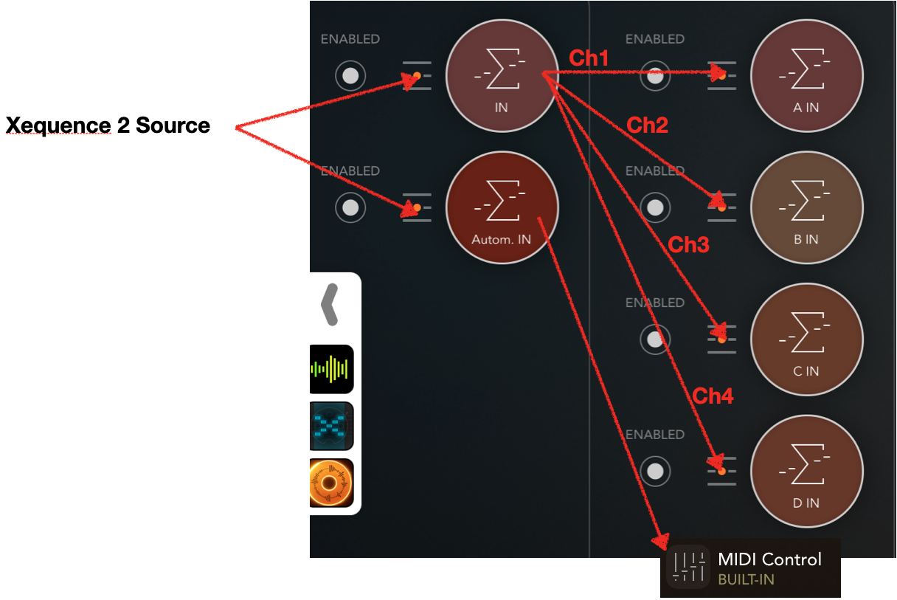

The "A", "B", "C", ... Midi in will naturally be mapped to instruments in AUM channel named "A", "B" "C" , ... 
The template does not map them for you,  this is most probably the only mapping you have to do. When using an external
MIDI keyboard you can use it from Xequence Directly and play from there. 

The "Autom. IN" MIDI bus is mapped to the AUM "MIDI Control", this is aimed to handle any automation coming from Xequence 2 to faders, effects, etc... 
this is a separate input line so one can shut it off by disabling or switching it on a side. Out off the box, each
instrument has Volume and Pan mapped directly, FX1, FX2 and master have Volume and 3 slots to control effects. One can
then add as many as you want.  

They are 2 (optional) MIDI Auv3, both mapped to AUM "MIDI Control :  

- the MidiMixer from 4Pockets. Very handy to mix everything from one page and record some mixing snapshots.
- the "Q Menu" which is actually a custom Nurack MIDI pad widget.  Used to navigate trough the project. It is a low profile discreet 
  MIDI AUV3 which shall be all the time open in order to lunch the Mixer from anywhere and move across the project
  (which is faster than going to the bookmark menu, see video). 

 
#### Audio inputs

Then comes the Audio inputs (2 for this example: "Audio Recorder A" and "Audio Recorder B"). This is where one can tune
the input level and maybe add some effects to be recorded. The loopy pro AUV3 instances (in audio bus) are receiving these inputs. 

### Instrument Mixer 

Then comes the Instrument driven by MIDI incoming notes from the MIDI bus A, B, C, .... which must be mapped when
loading instruments for the first time. 

 

It is important to keep the pairing (e.g. "A" MIDI in to "A" instrument) because the control of the AUM channel is
mapped by channel. 
For all my projects  A is always channel 1, B always channel 2, etc ...  

### Audio Mixer 

The recorded audio clips are coming after and have the name "Audio A", "Audio B", ... 

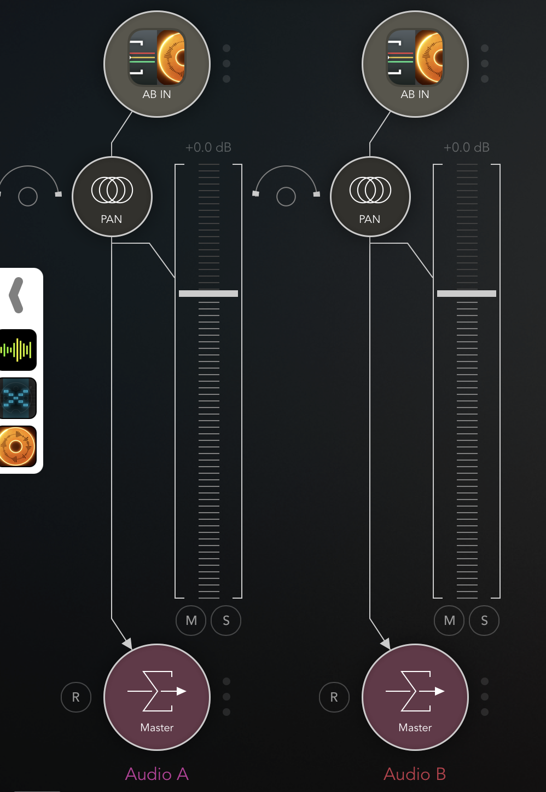

The Audios starts from Channel 9, e.g. "Audio A" control channel (volume, pan etc ...) is mapped to channel 9, always; "Audio B"
to channel 10 and so on. The audio is coming from AudioBus via Loopy Pro.

### Master 

Two FX buses and the Master is following. Master controls are mapped to Channel 16, FX1 to channel 15 and FX2 to Channel
14. It is on the reverse order so one can add more if not interfering with other Audio lines or MIDI instrument lines.  

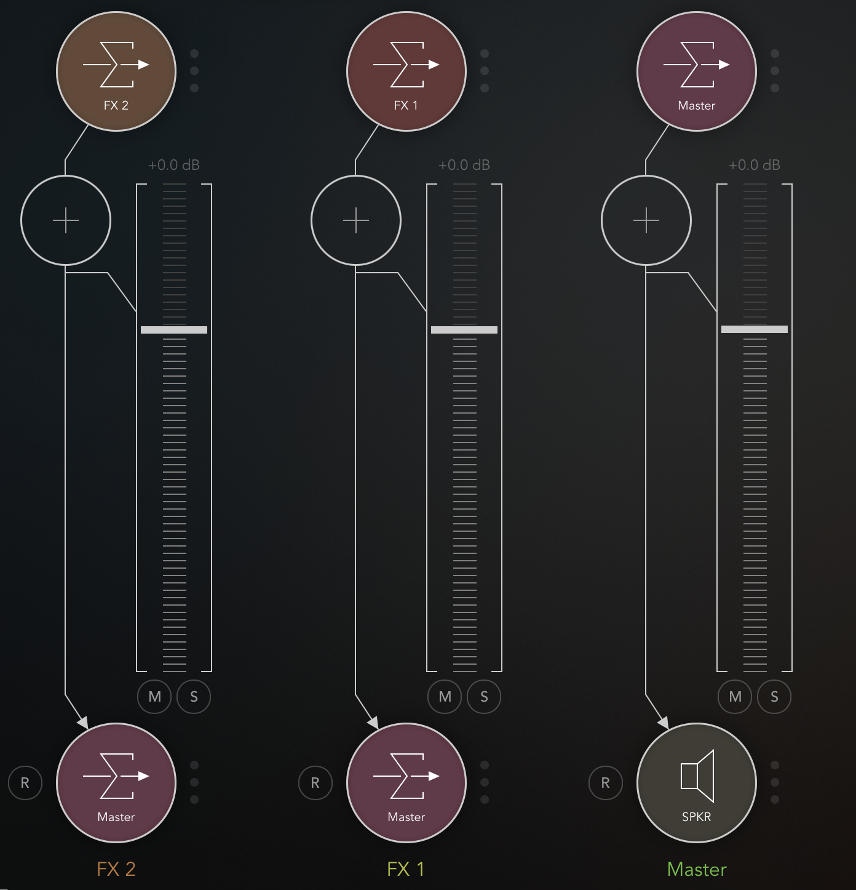

### MIDI outputs

Finally this is the MIDI output rooting. This is mainly use when one wants to record MIDI generator AUV3 from AUM to
Xequence 2.  Either you connect the MIDI AUV3 directly to the OUT Midi bus (when recording track by track) or one can
root several MIDI sources to A OUT, B OUT, C OUT, ... when recording  several MIDI track on the Xequence 2 side.       

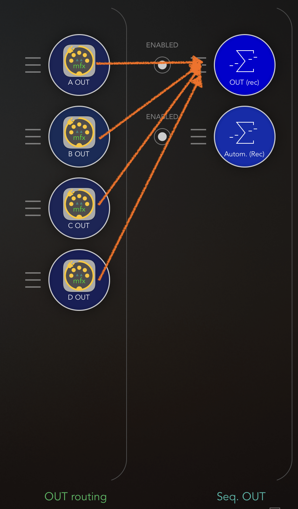

The individual channel output are actually a small AUV3 call mfxStrip 

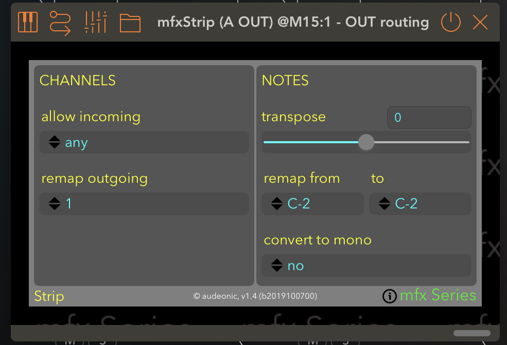

It convert Any MIDI channels to the appropriate channel (1 for A, 2 for B, etc ...). In this way one can plug multi
output MIDI generator without having to care about the used channel by the generator (some MIDI generators does not have the option to
change channels).

The Main OUT is mapped to *Xequence Destination* as well as the *Autom Rec* which is dedicated to record automation or LFO
for instance. 

## Xequence 2 

The Xequence project is obviously using the same naming, the A instrument is mapped to the Xequence Source Channel 1,
B->2 , C->3, D->4, Audio A->9 , Audio B -> 10, FX2 -> 14, FX1 -> 15, Master -> 16 

 

By default each instrument has its MIDI track. Audio A, Audio B, ...,  FX2, FX1, and  Master MIDI track are there to
record automation.

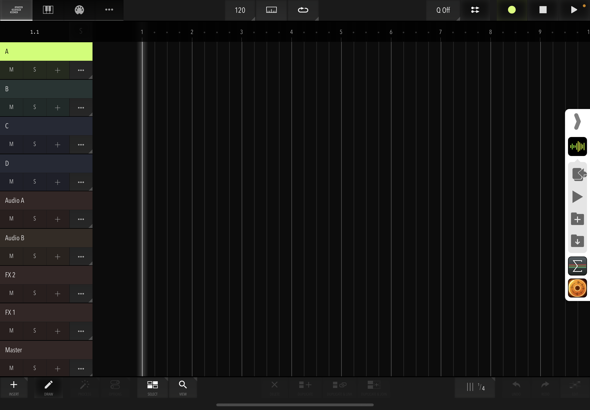 

In multitrack record each track receive the Xequence destination source to its corresponding MIDI channel (A->1, B->2,
...). In single track recording the selected track is receiving all the MIDI Xequence is connected with. 

On the configuration side the "virtual source" and "MIDI thru" shall be turned on. 

MIDI thru allows to be able to work directly from Xequence without having to care of mapping things on AUM side. My
keyboard controller is one of the MIDI source of Xequence 2 and when playing it will go to the "A", "B", or "C", etc 
MIDI bus on AUM and the corresponding instrument.

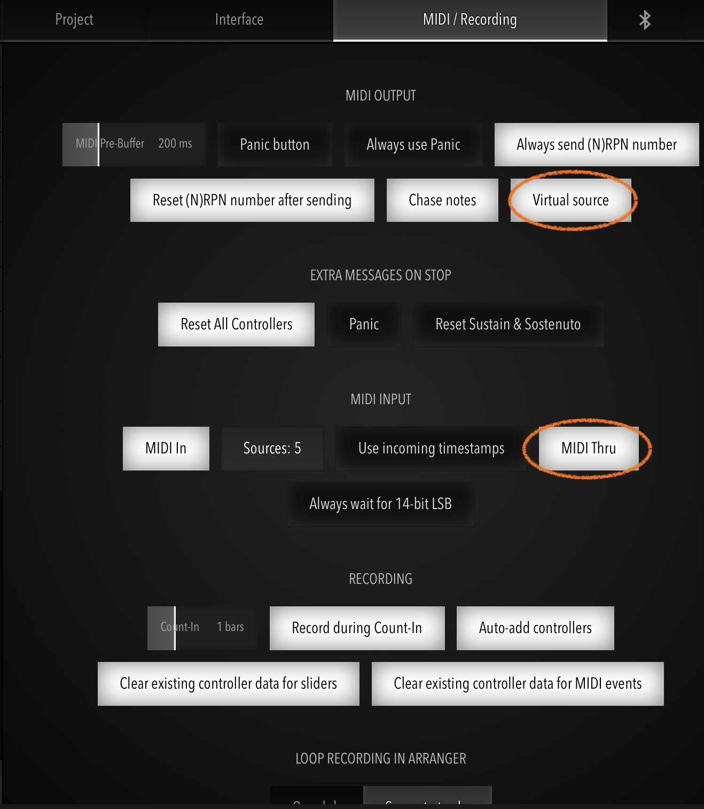

Also, one has to make sure that the Send Sync is enable on at least one instrument. Which should be the case when
loading the template. 

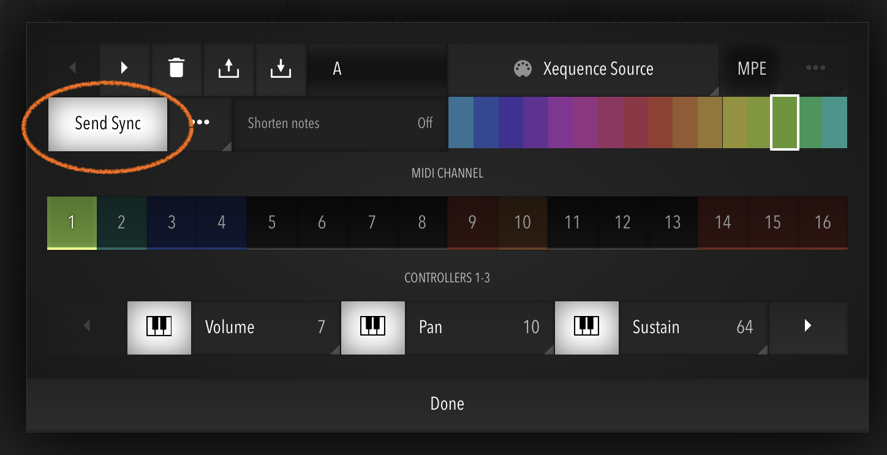

## Audio Bus 

### MIDI 

Adding the Xequence 2 somewhere in the MIDI section of audioBus allows to have it in the always shown Audio Bus small
menu and allows to save its state. 

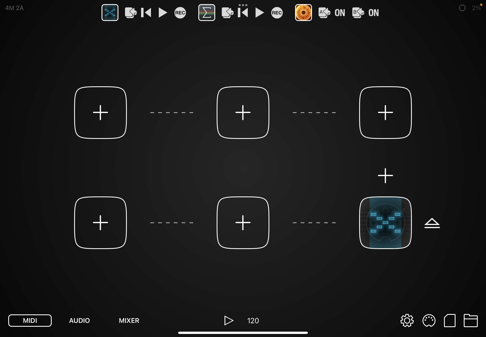

### AUDIO 

In this example I have two audio lines with two instances of Loopy Pro (AUV3) as clip recorder. Sources are coming from
AUM (The "Audio A recorder" and "Audio B  Recorder") and output to AUM as well ("Audio A" and "Audio B" channel on AUM). 

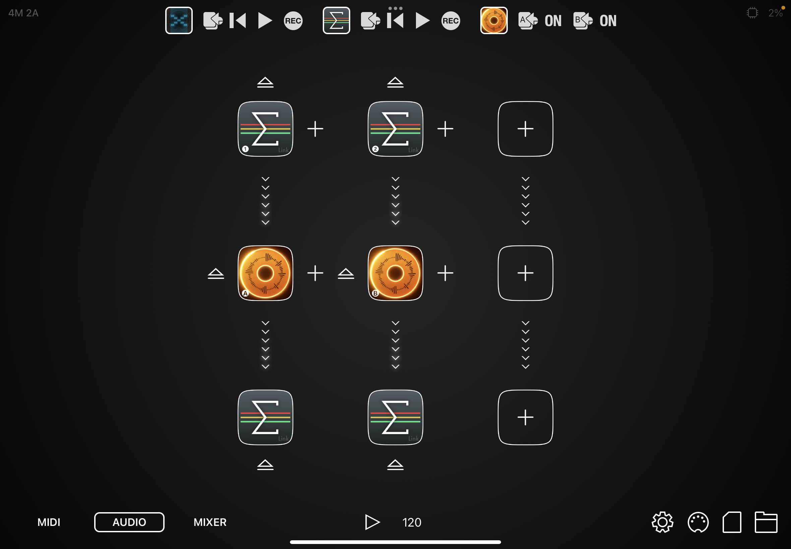

> **Why does Loopy pro AUV3 are not instantiated directly in AUM ?**

Good question. This is because AUM cannot receive MIDI clock in (at least in 2022-09-07). In other word AUM cannot follow the song position
mastered by Xequence 2. But Audiobus can and it transfer this to Loopy pro AUV3 instances.

Each instances of Loopy pro has several clips (3 linear, 2 loops) for a good start. One can remove or add on the go.
The clips are supposed to represent a take or part of the song for the same audio instrument (voice, drum , guitar, ...). 

Clips are placed inside the Loopy Pro Sequencer following the song timeline mastered by Xequence and though Audio Bus.
The Loopy Pro sequencer can be use also to punch in and out a record by drawing an empty clip inside the sequencer.  

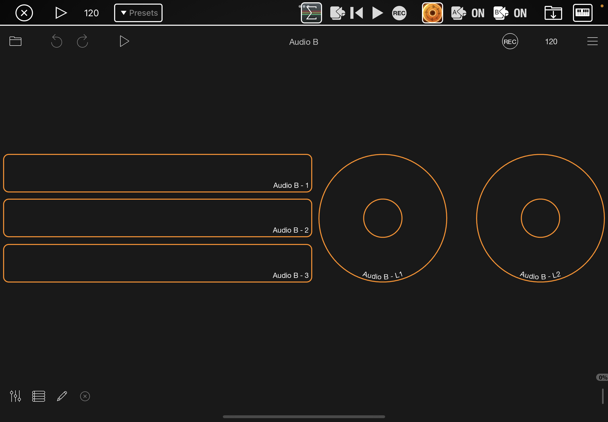

### CONFIG 

One must unable the MIDI clock in on audiobus, I have also disabled Ableton link so it does not interfere with the MIDI
clock. 

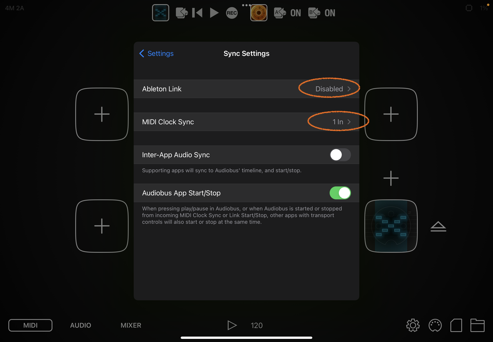

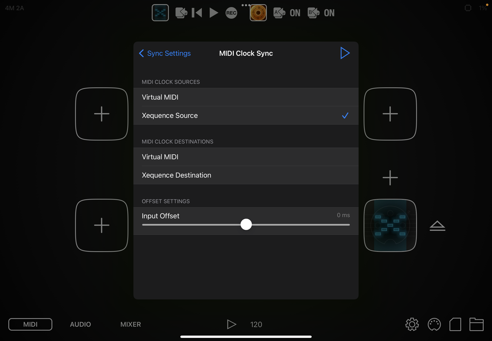

# BONUS !

## Faking an Audio clip 

When you want to place an audio clip directly in Xequence 2, there is a possibility. Unfortunatly it is using Sample Wiz
which is a very good App but not quite made for that kind of job. Didn't find any Cip launcher, Audio recorded which can
do that. 

This is explained in this video: 

The idea is :

- map from Xequence 2 to Sample Wiz the "Sample Start" MIDI message. 
- Make a linear ramp of that message in a MIDI clip in Xequence 2. The ramp (from 0 to 100%) must have the same length than the Audio
  clip played
- make a note to start the clip (at SampleStart). 

Notes: 

- I am using Pitch Bend because I can send a 14bit MIDI message which will be more accurate for long audio clip than the
  regular 2**^7=128 MIDI message. With 14 bits on, let say, a 5minutes clip on a 120 bit/minutes you have a time resolution
  of 0.04 bits ! More than enough.

- On Xequence "Shase Note" should be unabled in MIDI/Recording config 

Then you can place your "fake" Audio clip anywhere. 

